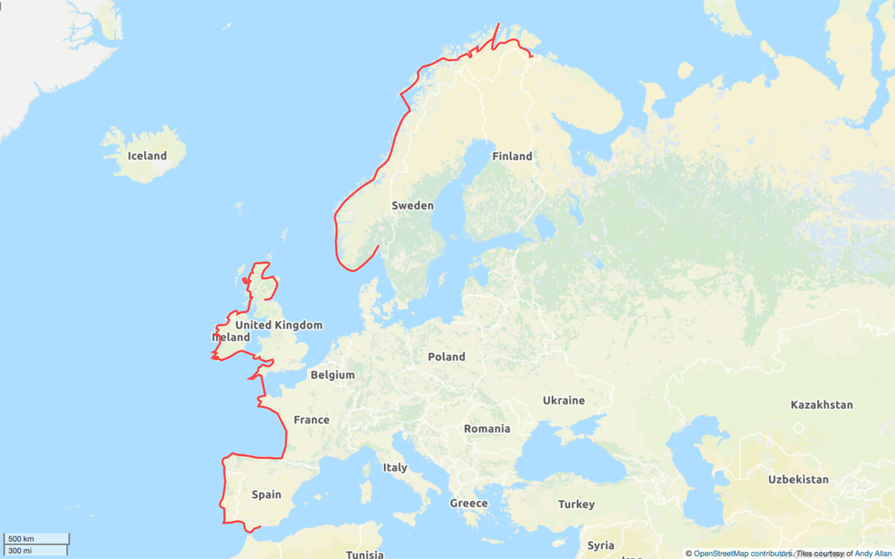

---
Blog Title:	A ride along the coast
About:	Cycling the Atlantic coast of Europe from north to south during the summer of 2017. Still taking it one day at a time. View the <a href="archive.html">archive</a>.
Reset:	Kirkenes
Class:	coast
Title:	A new start
Date:	2017-04-20T22:18:00+BST
---

In 2014 and 2015 I followed Thomas Stevens' cycle rides of 1884 and 1885 across the US and Europe. At Istanbul I said goodbye and wished him well on his trip around the world (130 years in the past). Now, two years later I've decided to set out on a new adventure.

Whilst crossing Europe in 2015 I was interested to find out about the Eurovelo routes that criss-cross the continent. One of them caught my eye particularly. It was [Eurovelo-1](http://www.eurovelo.com/en/eurovelos/eurovelo-1) and it described itself as the "Atlantic Coast Route". I've always been attracted to the rugged Atlantic Coast. I'm not really sure why. I grew up about as far from the coast as you could be in the north of England. Unfortunately, Eurovelo-1 doesn't quite stay true to the coast. It cuts off some of the best bits of Scotland and heads across the middle of the Iberian peninsula. If I was going to cycle the Atlantic coast of Europe, I was going to keep to the coast as much as possible.

Last year, once my fears about geo-politics came true, I realised I'd have to get a move on and do this trip in 2017 if it was going to happen at all. So, the plan became more urgent. Eurovelo-1 is billed as 5000 miles so it will be longer than the US (4293 miles in 99 days) and Europe (2888 miles in 60 days). I'm giving myself between 3 and 4 months to do it in.

The plan (at the moment) is to fly to [Kirkenes, Norway](http://www.openstreetmap.org/#map=9/69.7329/30.0751) some time around mid June and get to the northern-most point of Norway for the Summer Solstice. Then follow the coast all the way to Oslo. At that point I need to somehow get across to Aberdeen (TBD). I then follow the coast of Scotland up to John O'Groats and around the west coast before getting the [ferry from Campbeltown to Ballycastle](http://www.kintyreexpress.com/ferry%20service.html) (bikes are free!). Then around the coast of Northern Ireland (taking in Giant's Causeway) and the Republic of Ireland to Rosslare. There I take a ferry over to Fishguard, cycle the south Wales coast and around Devon and Cornwall (via Land's End). Then I'll probably take a ferry from Plymouth to Roscoff in Brittany before cycling down the west coast of France to Spain. At this point I may end up on the northern route of the Camino de Santiago. I'll then cycle down through Portugal and back into Spain to reach the southern tip - Tarifa. After that I'll probably carry on to Gibraltar (because it isn't far) then fly back from Malaga (I can get a cheap flight home).

That is the plan. It is deliberately less of a planned itinerary than I had on the last two trips. This time it'll be my own route and timings rather than those of a man dealing with the roads of 130 years earlier. I'll be able to adapt more. It'll be sad not to have Stevens as my guide but I'll take him along with me for this new adventure.

Two months and counting.